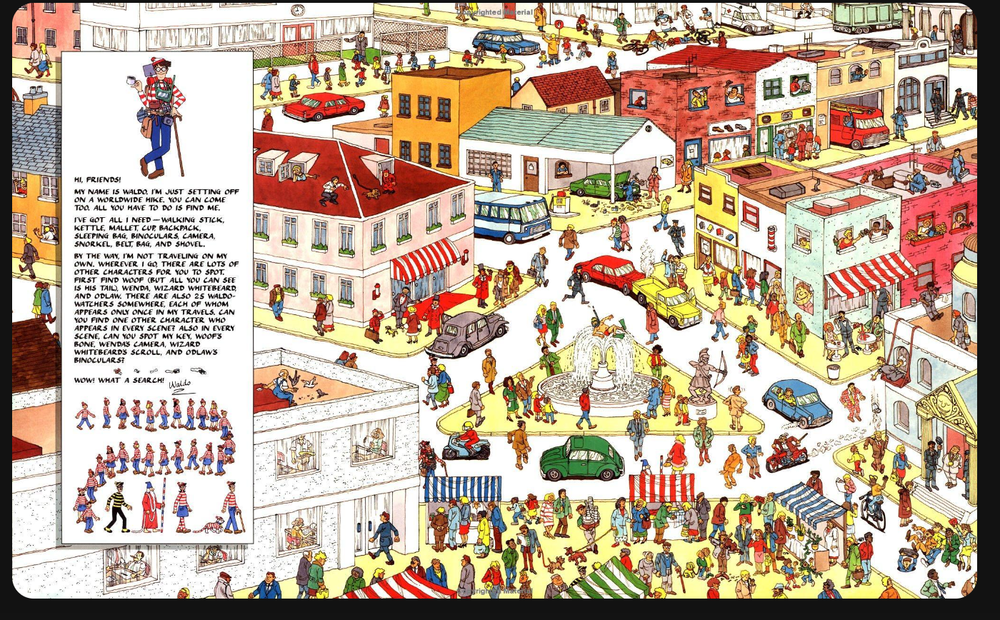

# Where's Waldo Website

### Description

This is a photo tagging game using where's waldo maps. You go through three different maps and are timed from the start. You will have to find four characters: Waldo, Odlaw, Wizard, and Wenda. Once you have passed your time will be recorded on the leaderboard. Make sure to enter you name at the beginning!

### Stack

This uses React in the frontend, with an express and node backend. The database being used is a MongoDB database, being connected with Mongoose.
